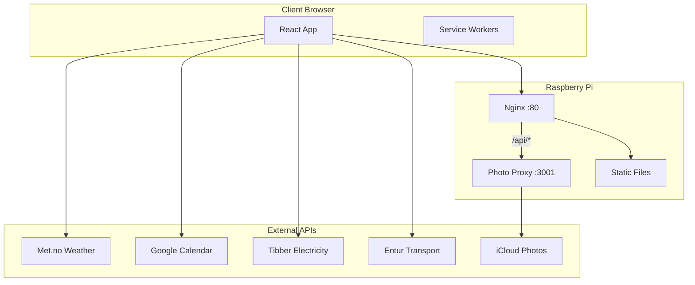

# Kiosk App Architecture

Technical architecture documentation for the Kiosk Dashboard application.

## Documents

### Overview
| Document | Description |
|----------|-------------|
| [Widgets Overview](./widgets.md) | Architecture patterns, caching, refresh strategies |
| [Raspberry Pi Infrastructure](./raspberry-pi-infrastructure.md) | DevOps guide for Pi setup and operations |

### Widget Documentation
| Widget | Document | Data Source |
|--------|----------|-------------|
| Weather | [widget-weather.md](./widget-weather.md) | Met.no API |
| Photo Slideshow | [photo-slideshow.md](./photo-slideshow.md) | iCloud + backend proxy |
| Calendar | [widget-calendar.md](./widget-calendar.md) | Google Calendar API |
| Electricity | [widget-electricity.md](./widget-electricity.md) | Tibber GraphQL + WebSocket |
| Transport | [widget-transport.md](./widget-transport.md) | Entur GraphQL |

## System Overview



## Technology Stack

| Layer | Technology |
|-------|------------|
| Frontend | Preact + TypeScript |
| Styling | Tailwind CSS |
| Build | Vite |
| Backend | Node.js (native HTTP) |
| Web Server | Nginx |
| Process Manager | systemd |
| Hardware | Raspberry Pi Zero W 2 |

## Key Design Decisions

### 1. Preact over React

- **Why**: 3KB vs 40KB bundle size
- **Trade-off**: Some React ecosystem incompatibility
- **Mitigation**: preact/compat alias in Vite

### 2. Backend Photo Proxy

- **Why**: iCloud URLs expire after ~2 hours
- **Trade-off**: Additional server process
- **Mitigation**: Fallback to static JSON, auto-restart via systemd

### 3. Module-Level Caching

- **Why**: Persist cache across component remounts
- **Trade-off**: Memory not freed on unmount
- **Mitigation**: Reasonable TTLs, Pi has 512MB RAM

### 4. Norwegian Localization

- **Why**: Target audience is Norwegian family
- **Trade-off**: Hardcoded strings
- **Mitigation**: Could extract to i18n if needed

## Data Flow Patterns

### Pull-Based (HTTP)

```
Component → Hook → Service → External API
    ↑                            ↓
    └──── Cached Response ───────┘
```

Used by: Weather, Calendar, Electricity prices, Transport, Photos

### Push-Based (WebSocket)

```
Component ← Hook ← WebSocket ← External API
```

Used by: Tibber live consumption

## Refresh Intervals

| Widget | Interval | Rationale |
|--------|----------|-----------|
| Weather | 30 min | Data updates hourly |
| Photos | 10 min | Server caches for 45 min |
| Calendar | 15 min | Events don't change often |
| Electricity | 5 min | Prices update hourly |
| Transport | 1 min | Real-time departures |
| Live Power | ~2 sec | WebSocket push |

## Error Handling Philosophy

1. **Never crash** - Show stale data over nothing
2. **Fail silently** - Log errors, show user-friendly messages
3. **Degrade gracefully** - Widget shows "not configured" vs error
4. **Recover automatically** - Auto-retry on next refresh interval
