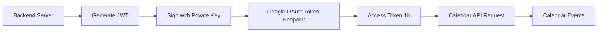

# Calendar Widget - Service Account Setup

## Overview

The calendar widget uses **Google Service Account authentication** to access Google Calendar API. This is the correct approach for server-side applications that need to access calendars without user interaction.

| Property | Value |
|----------|-------|
| Authentication Method | Service Account (JWT) |
| API | Google Calendar API v3 |
| Scope | `https://www.googleapis.com/auth/calendar.readonly` |
| Token Validity | 1 hour (auto-renewed) |
| Credentials Storage | Base64-encoded JSON key in `config.internal.json` |

## Why Service Account (Not OAuth)?

**Service Account** is the correct choice for this use case because:
- ✅ No user interaction required - works headless on Raspberry Pi
- ✅ Long-lived credentials - JSON key file never expires
- ✅ Server-to-server authentication - secure backend-only
- ✅ No refresh token expiration issues

**OAuth 2.0 User Flow** (NOT used) would require:
- ❌ User consent flow on every token refresh
- ❌ Refresh tokens can expire/be revoked
- ❌ More complex setup with redirect URIs

## Architecture



### Authentication Flow

1. Backend reads service account JSON key from config (base64-encoded)
2. Generates JWT payload with service account email and calendar.readonly scope
3. Signs JWT with private key (RS256 algorithm)
4. Exchanges JWT for access token at Google OAuth endpoint
5. Uses access token as Bearer token for Calendar API requests
6. Caches access token for 1 hour (with 5-min buffer for renewal)

## Current Configuration

**Service Account:**
- Project ID: `familycalendar-489421`
- Email: `pi-537@familycalendar-489421.iam.gserviceaccount.com`
- Key ID: `c33fae59ef6322f4e67b7625859​4e0ff9c3356c4`

**Configured Calendars:**
1. `espenrydningen@gmail.com` → Espen (red)
2. `lenebu@gmail.com` → Lene (green)
3. `ida.munkeby@gmail.com` → Ida (purple)
4. `markus.munkeby@gmail.com` → Markus (blue)

## Setup Instructions

### 1. Create Google Cloud Project & Service Account

```bash
# 1. Go to Google Cloud Console
https://console.cloud.google.com

# 2. Create new project (if not exists)
Project Name: Family Calendar
Project ID: familycalendar-489421

# 3. Enable Calendar API
APIs & Services → Library → Search "Google Calendar API" → Enable

# 4. Create Service Account
IAM & Admin → Service Accounts → Create Service Account

Name: Kiosk Pi Calendar Access
Email: pi-537@familycalendar-489421.iam.gserviceaccount.com
Role: None (calendars will be shared explicitly)

# 5. Create JSON Key
Click on service account → Keys → Add Key → Create New Key → JSON
Download: familycalendar-489421-xxxxx.json
```

### 2. Share Calendars with Service Account

**CRITICAL STEP:** Each family member must share their calendar with the service account email.

For each calendar that should appear on the kiosk:

1. Open Google Calendar (calendar.google.com)
2. Find the calendar in the left sidebar
3. Click the three dots → **Settings and sharing**
4. Scroll to **Share with specific people**
5. Click **Add people**
6. Enter: `pi-537@familycalendar-489421.iam.gserviceaccount.com`
7. Permission: **See all event details**
8. Click **Send**

**Verify sharing:**
```bash
# Test API access (should return events, not 401/403)
curl -H "Authorization: Bearer $(node -e "console.log(require('jsonwebtoken').sign({iss:'pi-537@familycalendar-489421.iam.gserviceaccount.com',sub:'pi-537@familycalendar-489421.iam.gserviceaccount.com',scope:'https://www.googleapis.com/auth/calendar.readonly',aud:'https://oauth2.googleapis.com/token',exp:Math.floor(Date.now()/1000)+3600,iat:Math.floor(Date.now()/1000)}, '$(cat key.json | jq -r .private_key)', {algorithm:'RS256'}))")" \
"https://www.googleapis.com/calendar/v3/calendars/espenrydningen@gmail.com/events?maxResults=5"
```

### 3. Configure Kiosk App

**Via Admin UI (Recommended):**

1. Navigate to `http://pi.local/admin/login`
2. Enter PIN
3. Go to Calendar Settings
4. Upload service account JSON file OR paste base64-encoded key
5. Add calendar IDs (email addresses of shared calendars)
6. Save with PIN verification

**Via SSH (Manual):**

```bash
# 1. SSH to Pi
ssh pi@pi.local

# 2. Base64 encode the service account JSON key
cat familycalendar-489421-xxxxx.json | base64 -w 0 > key.b64

# 3. Edit internal config
# Add to /var/www/kiosk/server/data/config.internal.json:
{
  "calendar": {
    "serviceAccountKey": "<paste base64 key here>",
    "calendars": [
      {
        "id": "espenrydningen@gmail.com",
        "name": "Espen",
        "color": "#f44355"
      },
      {
        "id": "lenebu@gmail.com",
        "name": "Lene",
        "color": "#43f478"
      }
    ]
  }
}

# 4. Restart backend server
sudo systemctl restart kiosk-backend
```

### 4. Verify Setup

```bash
# 1. Check backend logs for errors
ssh pi@pi.local "journalctl --since '5 minutes ago' | grep -i calendar"

# 2. Test API endpoint
curl http://pi.local/api/calendar/events | jq '.events | length'

# 3. Expected output: Number of upcoming events (not 0 if calendars have events)
# 4. If output is {"events": [], "error": "..."} → Check error message
```

## Common Issues & Troubleshooting

### Issue: "Request had invalid authentication credentials"

**Cause:** Calendar not shared with service account email

**Fix:**
1. Verify service account email: `pi-537@familycalendar-489421.iam.gserviceaccount.com`
2. Check calendar sharing settings in Google Calendar
3. Ensure permission is "See all event details" (not just "See only free/busy")
4. Wait 1-2 minutes for Google to propagate sharing changes

**Test:**
```bash
ssh pi@pi.local "curl -s http://localhost:3001/api/calendar/events | jq '.events'"
```

### Issue: "Calendar not configured"

**Cause:** Service account key or calendar IDs not set in config

**Fix:**
1. Check `/var/www/kiosk/server/data/config.internal.json` exists
2. Verify `calendar.serviceAccountKey` is set (base64 string)
3. Verify `calendar.calendars` array has at least one calendar

### Issue: "Failed to generate JWT" or "Invalid private key"

**Cause:** Corrupted or invalid service account JSON key

**Fix:**
1. Download fresh JSON key from Google Cloud Console
2. Verify JSON is valid: `cat key.json | jq .`
3. Re-encode to base64: `cat key.json | base64 -w 0`
4. Update config with new key

### Issue: Calendar shows but no events

**Cause:** Service account has access but calendars are empty for the next 7 days

**Verify:**
1. Check calendar has events in the next 7 days (widget only shows upcoming)
2. Test API response: `curl http://pi.local/api/calendar/events`
3. Check backend logs: `journalctl -u kiosk-backend | grep Calendar`

## Security Considerations

**Private Key Storage:**
- ✅ Service account private key is stored in `config.internal.json` (file permissions: 600)
- ✅ Only accessible to backend server (not exposed to frontend)
- ✅ Base64 encoding is NOT encryption - key file must be protected
- ✅ Pi user has read/write, root has backup copy

**Best Practices:**
1. Never commit service account JSON to git
2. Use `.gitignore` to exclude `server/data/*.json`
3. Rotate service account keys annually
4. Use principle of least privilege (read-only calendar scope)
5. Monitor service account usage in Google Cloud Console

## Implementation Details

**Code Location:** `server/src/handlers/calendar.ts`

**Key Functions:**
```typescript
generateServiceAccountJWT(serviceAccountKey: string): string
  → Decodes base64 key, generates signed JWT with RS256

getServiceAccountToken(serviceAccountKey: string): string
  → Returns cached JWT or generates new one (1 hour validity, 5-min buffer)

handleGetCalendarEvents(req, res): Promise<void>
  → Loads config, gets token, fetches all calendars in parallel, merges & sorts events
```

**Token Caching:**
- JWT cached in memory for 1 hour
- Renewed automatically when < 5 minutes remaining
- No disk I/O for token refresh (fast)

**Error Handling:**
- Per-calendar errors don't fail entire request
- Failed calendars return empty array, successful ones still shown
- Errors logged to journalctl for debugging

## Migration from OAuth (If Applicable)

If the app was previously using OAuth 2.0 refresh tokens:

1. **Remove OAuth credentials from config:**
   - Delete `calendar.clientId`
   - Delete `calendar.clientSecret`
   - Delete `calendar.refreshToken`

2. **Add service account credentials:**
   - Add `calendar.serviceAccountKey` (base64 JSON)
   - Keep `calendar.calendars` array unchanged

3. **Share calendars with service account** (see Step 2 above)

4. **Restart backend server:**
   ```bash
   sudo systemctl restart kiosk-backend
   ```

## Related Documentation

- [Calendar Widget Architecture](./widget-calendar.md) - OUTDATED, describes OAuth flow
- [Admin View](../../CLAUDE.md#admin-view-complete) - UI for managing config
- [Google Calendar API](https://developers.google.com/calendar/api/v3/reference)
- [Google Service Accounts](https://cloud.google.com/iam/docs/service-accounts)

## TODO: Fix Outdated Documentation

The following files incorrectly describe OAuth authentication and need updates:
- [ ] `docs/architecture/widget-calendar.md` - Update authentication section
- [ ] `scripts/README-calendar-oauth.md` - Remove or mark as deprecated
- [ ] `scripts/get-calendar-token.sh` - Remove or mark as deprecated
- [ ] `scripts/get-calendar-token-web.js` - Remove or mark as deprecated
- [ ] `CLAUDE.md` - Update Google Calendar OAuth Integration section
