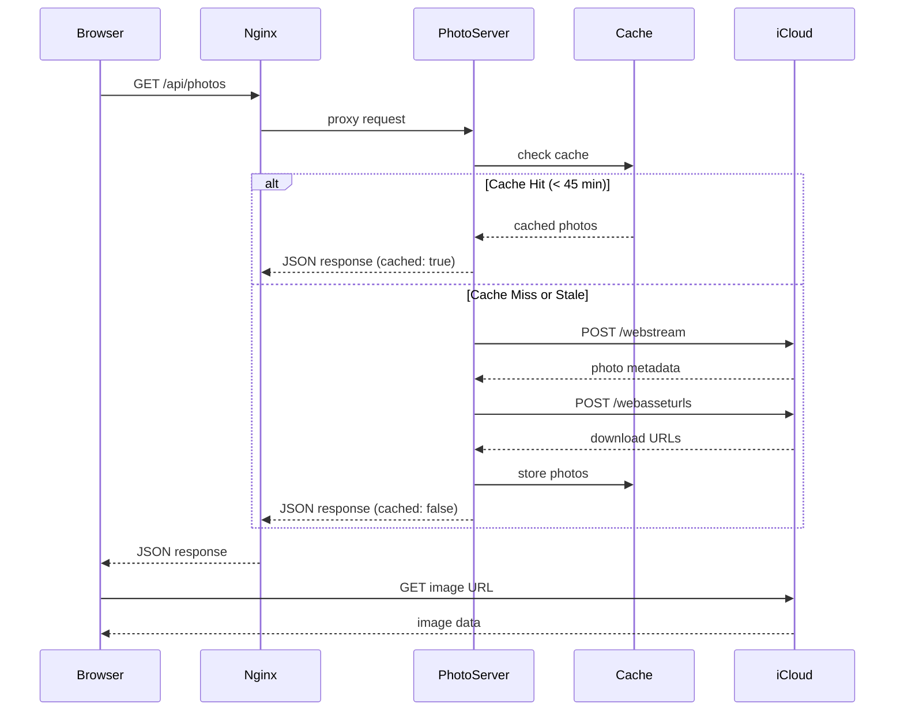
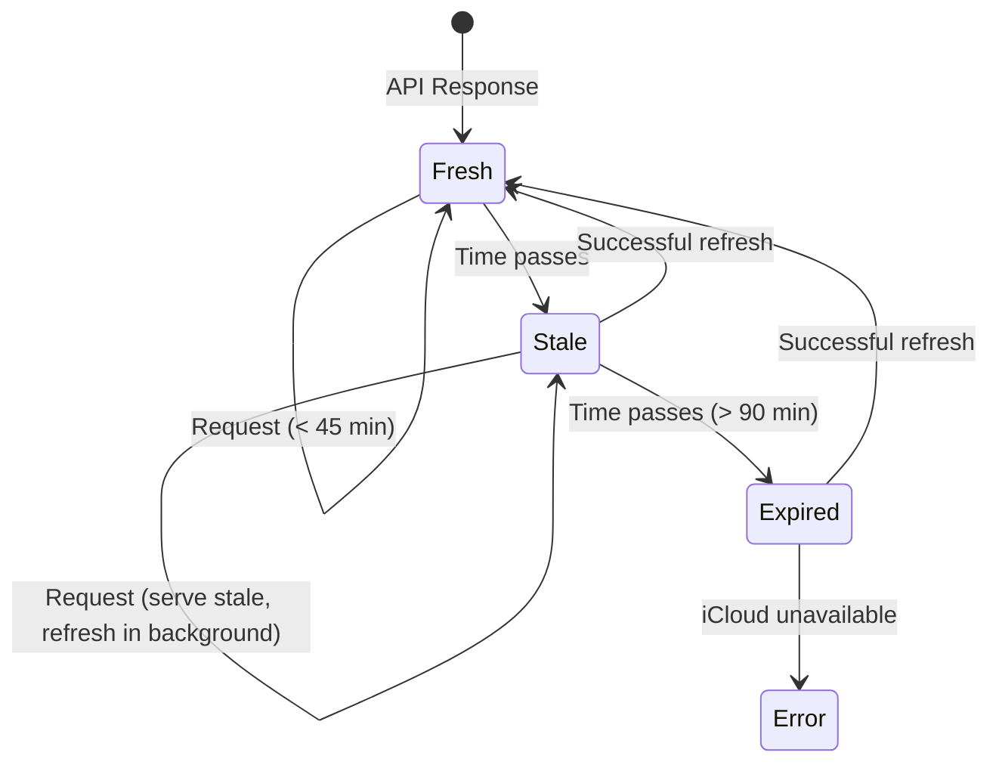
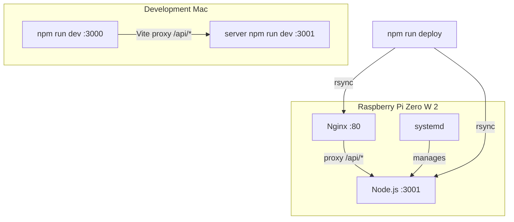
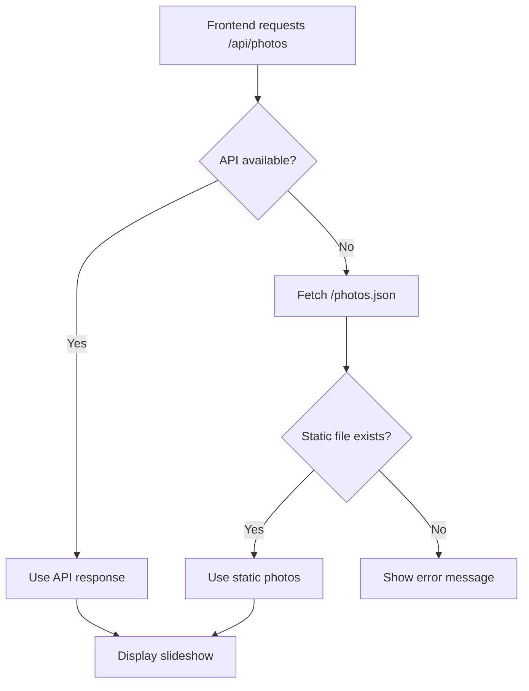

# Photo Slideshow Architecture

## Overview

The photo slideshow displays images from an iCloud Shared Album with automatic URL refresh to handle Apple's expiring URLs. The system uses a backend proxy server to fetch fresh URLs on-demand with caching.

## Problem Statement

iCloud Shared Album URLs contain an expiry timestamp (`e=` parameter) and return **401 Unauthorized** after approximately 2 hours. A purely client-side solution cannot recover from expired URLs without user intervention.

## Solution Architecture

```mermaid
flowchart TB
    subgraph "Raspberry Pi"
        subgraph "Frontend"
            A[Photo Slideshow Component]
            B[usePhotos Hook]
            C[photos.ts Service]
        end

        subgraph "Nginx :80"
            D[Static Files]
            E[/api/* Proxy]
        end

        subgraph "Photo Proxy Server :3001"
            F[HTTP Server]
            G[Cache Layer]
            H[iCloud API Client]
        end
    end

    I[(iCloud SharedStreams API)]

    A --> B
    B --> C
    C -->|GET /api/photos| E
    E -->|proxy_pass| F
    F --> G
    G -->|cache miss| H
    H -->|POST webstream| I
    H -->|POST webasseturls| I
    I -->|photo URLs| H
    G -->|cached response| F
    F -->|JSON| E
    E -->|JSON| C
```

## Components

### Frontend Layer

| Component | File | Responsibility |
|-----------|------|----------------|
| PhotoSlideshow | `src/components/sections/PhotoSlideshow/` | UI rendering, Ken Burns effect, crossfade transitions |
| usePhotos | `src/hooks/usePhotos.ts` | State management, auto-advance timer, preloading |
| photos service | `src/services/photos.ts` | API calls, response parsing, fallback handling |

### Backend Layer

| Component | File | Responsibility |
|-----------|------|----------------|
| HTTP Server | `server/src/index.ts` | Request routing, CORS, error handling |
| Cache | `server/src/cache.ts` | In-memory TTL cache with stale-while-revalidate |
| iCloud Client | `server/src/photos.ts` | SharedStreams API integration |

### Infrastructure

| Component | Configuration | Responsibility |
|-----------|---------------|----------------|
| Nginx | `/etc/nginx/sites-available/kiosk` | Static file serving, API proxying |
| systemd | `kiosk-photos.service` | Process management, auto-restart |

## Data Flow

### Request Sequence



### iCloud API Integration

The iCloud SharedStreams API is undocumented but follows this pattern:


**URL Construction:**
```
https://p{partition}-sharedstreams.icloud.com/{token}/sharedstreams
```

**Partition Calculation:**
- First character of token converted from base36
- `0-9` → 0-9
- `A-Z` → 10-35

## Caching Strategy



| State | Age | Behavior |
|-------|-----|----------|
| Fresh | 0-45 min | Serve from cache immediately |
| Stale | 45-90 min | Serve from cache, attempt refresh |
| Expired | > 90 min | Must refresh, fail if iCloud unavailable |

### Why These Values?

- **45-minute TTL**: iCloud URLs expire at ~2 hours. Refreshing at 45 minutes provides a safety margin.
- **90-minute max stale**: Allows serving photos during temporary iCloud outages while preventing serving URLs that are definitely expired.

## API Specification

### GET /api/photos

Returns photo URLs for the slideshow.

**Response:**
```json
{
  "photos": [
    { "url": "https://cvws.icloud-content.com/..." }
  ],
  "cached": true,
  "expiresAt": "2024-02-16T15:30:00Z"
}
```

**Error Response:**
```json
{
  "error": "ICLOUD_ALBUM_URL not configured"
}
```

### GET /api/health

Returns server health status.

**Response:**
```json
{
  "status": "ok",
  "uptime": 3600,
  "cacheAge": 1200,
  "photoCount": 97
}
```

## Deployment Architecture



### Memory Footprint

The Pi Zero W 2 has 512MB RAM. The photo server is designed for minimal memory usage:

| Component | RAM Usage |
|-----------|-----------|
| Node.js photo server | ~35 MB |
| Chromium (kiosk mode) | ~300 MB |
| System + Nginx | ~100 MB |
| **Available buffer** | ~75 MB |

Design decisions for low memory:
- Native Node.js `http` module (no Express)
- In-memory cache (no Redis)
- No image processing on server
- Single-threaded operation

## Configuration

### Environment Variables

| Variable | Location | Description |
|----------|----------|-------------|
| `ICLOUD_ALBUM_URL` | `/var/www/kiosk/.env` | iCloud shared album URL |
| `PORT` | systemd service | Server port (default: 3001) |

### Nginx Configuration

```nginx
server {
    listen 80 default_server;
    root /var/www/kiosk;
    index index.html;

    location /api/ {
        proxy_pass http://127.0.0.1:3001/;
        proxy_http_version 1.1;
        proxy_set_header Host $host;
        proxy_set_header X-Real-IP $remote_addr;
    }

    location / {
        try_files $uri $uri/ /index.html;
    }
}
```

### systemd Service

```ini
[Unit]
Description=Kiosk Photo Proxy Server
After=network.target

[Service]
Type=simple
User=pi
WorkingDirectory=/var/www/kiosk/server
ExecStart=/usr/bin/node /var/www/kiosk/server/dist/index.js
Restart=always
RestartSec=10
Environment=PORT=3001

[Install]
WantedBy=multi-user.target
```

## Fallback Behavior

The system includes graceful degradation:



The static `photos.json` fallback allows:
- Development without running the server
- Graceful handling of server crashes
- Backwards compatibility during migration

## Monitoring

### Health Checks

```bash
# Check service status
systemctl status kiosk-photos

# View logs
journalctl -u kiosk-photos -f

# Test API
curl http://localhost/api/health
```

### Key Metrics

| Metric | Source | Alert Threshold |
|--------|--------|-----------------|
| `uptime` | /api/health | < 60s (frequent restarts) |
| `cacheAge` | /api/health | > 5400s (90 min, stale) |
| `photoCount` | /api/health | 0 (no photos) |

## Security Considerations

1. **No authentication**: The API is internal-only, accessible only on the local network
2. **No secrets in code**: iCloud album URL stored in `.env` file
3. **Read-only**: Server only fetches data, never modifies iCloud content
4. **CORS enabled**: Required for development proxy but safe on internal network

## Future Improvements

1. **WebSocket subscription**: Push new photos to frontend instead of polling
2. **Image caching**: Cache images on Pi to reduce bandwidth
3. **Multiple albums**: Support multiple iCloud albums with rotation
4. **Offline mode**: Store photos locally for network outages
