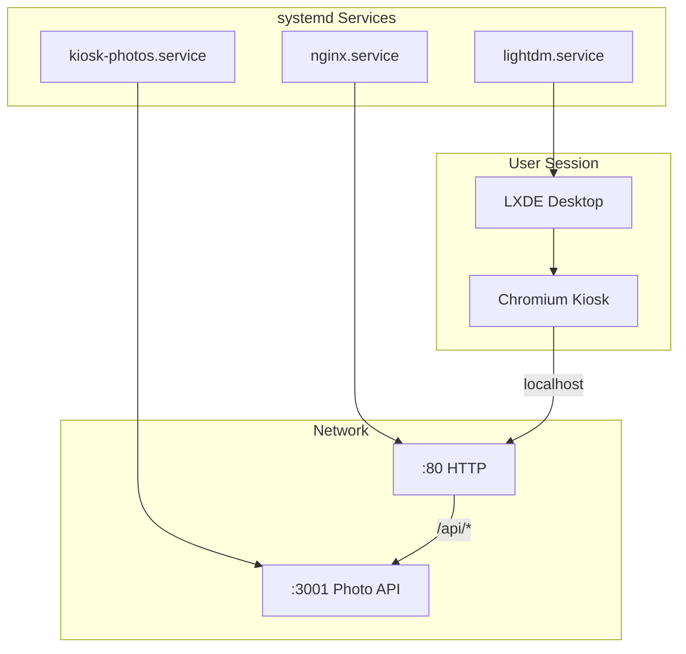
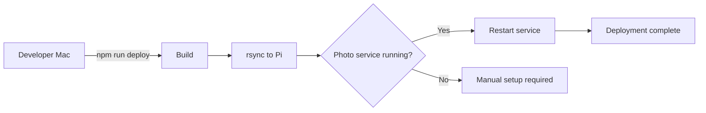
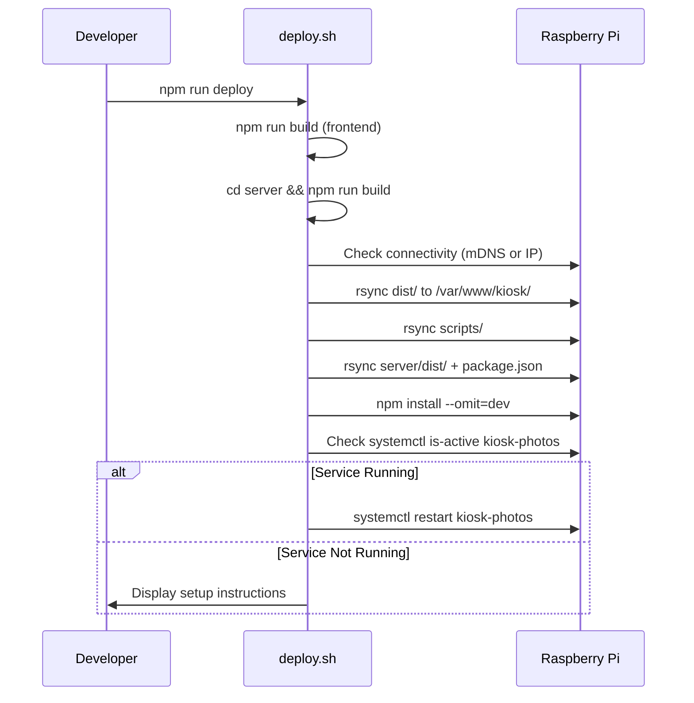
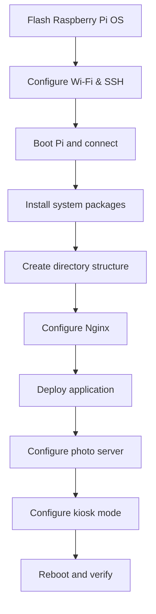

# Raspberry Pi Infrastructure

## Overview

The kiosk application runs on a Raspberry Pi Zero W 2 configured as a dedicated display appliance. This document covers infrastructure setup, service management, deployment procedures, and operational runbooks.

## Hardware Specifications

| Component | Specification |
|-----------|---------------|
| Model | Raspberry Pi Zero W 2 |
| CPU | BCM2710A1, Quad-core ARM Cortex-A53 @ 1GHz |
| RAM | 512 MB LPDDR2 |
| Storage | 64 GB microSD |
| Network | 2.4GHz 802.11 b/g/n Wi-Fi |
| Display | 32" TV via mini-HDMI (768x1366 portrait) |

## System Configuration

### Operating System

```
Distribution: Raspbian GNU/Linux 12 (bookworm)
Kernel: 6.12.x armv6l
Hostname: raspberrypizerow2
```

### Network Configuration

| Interface | Configuration |
|-----------|---------------|
| Hostname (mDNS) | `raspberrypizerow2.local` |
| Static IP | `192.168.50.37` |
| DNS Discovery | Avahi daemon (mDNS/Bonjour) |

## Service Architecture



### Service Inventory

| Service | Type | Port | Purpose |
|---------|------|------|---------|
| nginx | systemd | 80 | Web server, reverse proxy |
| kiosk-photos | systemd | 3001 | Photo URL proxy server |
| lightdm | systemd | - | Display manager, auto-login |
| avahi-daemon | systemd | 5353 | mDNS hostname resolution |

## Application Directory

```
/var/www/kiosk/
├── dist/                   # Frontend built files (Nginx root)
│   ├── index.html          # Main application entry
│   ├── assets/
│   │   ├── index-*.js      # Bundled JavaScript
│   │   └── index-*.css     # Bundled CSS
│   └── photos.json         # Fallback static photos
├── server/
│   ├── dist/
│   │   ├── index.js        # Photo proxy server
│   │   ├── photos.js       # iCloud API client
│   │   └── cache.js        # Caching layer
│   ├── package.json
│   └── node_modules/
├── scripts/
│   ├── deploy.sh           # Deployment script
│   ├── setup-photo-server.sh
│   ├── sync-photos.sh      # Legacy (backup)
│   └── kiosk-photos.service
└── .env                    # Configuration secrets
```

## Configuration Files

### Nginx Site Configuration

**Location:** `/etc/nginx/sites-available/kiosk`

```nginx
server {
    listen 80 default_server;
    root /var/www/kiosk/dist;  # Points to dist/ within symlink target (auto-deploy) or direct path (manual deploy)
    index index.html;

    location /api/ {
        proxy_pass http://127.0.0.1:3001/;
        proxy_http_version 1.1;
        proxy_set_header Host $host;
        proxy_set_header X-Real-IP $remote_addr;
    }

    location / {
        try_files $uri $uri/ /index.html;
    }
}
```

**Symlink:** `/etc/nginx/sites-enabled/kiosk -> /etc/nginx/sites-available/kiosk`

### Directory Structure

The kiosk uses a consistent directory structure regardless of deployment method:

```
/var/www/kiosk/
├── dist/                      # Frontend built files (served by Nginx)
│   ├── index.html
│   ├── assets/
│   │   ├── index-*.js
│   │   └── index-*.css
│   ├── puppeteer-test.html
│   └── test.html
├── server/                    # Backend Node.js server
│   ├── dist/                  # Compiled TypeScript
│   └── package.json
├── scripts/                   # Deployment and maintenance scripts
├── .env                       # Environment variables (iCloud album URL)
└── VERSION                    # Current version (auto-deploy only)
```

**Deployment Method Differences:**

| Method | Structure | Notes |
|--------|-----------|-------|
| **Manual Deploy** (`deploy.sh`) | Direct files in `/var/www/kiosk/dist/` | Simple, immediate |
| **Auto-Deploy** (`auto-update.sh`) | Symlink: `/var/www/kiosk` → `/var/www/kiosk-releases/v2026.XX.XX/` | Versioned, atomic rollback |

Both methods result in Nginx serving from `/var/www/kiosk/dist/`.

### Photo Proxy Service

**Location:** `/etc/systemd/system/kiosk-photos.service`

```ini
[Unit]
Description=Kiosk Photo Proxy Server
After=network.target

[Service]
Type=simple
User=pi
WorkingDirectory=/var/www/kiosk/server
ExecStart=/usr/bin/node /var/www/kiosk/server/dist/index.js
Restart=always
RestartSec=10
Environment=PORT=3001

[Install]
WantedBy=multi-user.target
```

### Environment Configuration

**Location:** `/var/www/kiosk/.env`

```bash
ICLOUD_ALBUM_URL=https://www.icloud.com/sharedalbum/#<token>
```

## Deployment Pipeline



### Deployment Script Flow



### Deployment Commands

```bash
# Full deployment from dev machine
npm run deploy

# Manual deployment steps
npm run build
cd server && npm run build
rsync -avz dist/ pi@raspberrypizerow2.local:/var/www/kiosk/
rsync -avz server/dist/ pi@raspberrypizerow2.local:/var/www/kiosk/server/dist/
rsync -avz server/package.json pi@raspberrypizerow2.local:/var/www/kiosk/server/
ssh pi@raspberrypizerow2.local "cd /var/www/kiosk/server && npm install --omit=dev"
```

## Initial Setup Procedure

### Prerequisites

1. Raspberry Pi OS (Bookworm) installed
2. Wi-Fi configured and connected
3. SSH enabled

### Step-by-Step Setup



#### 1. System Package Installation

```bash
# Connect to Pi
ssh pi@raspberrypizerow2.local

# Update system
sudo apt update && sudo apt upgrade -y

# Install required packages
sudo apt install -y nginx nodejs npm avahi-daemon

# Verify installations
nginx -v
node --version
npm --version
```

#### 2. Directory Setup

```bash
# Create application directory
sudo mkdir -p /var/www/kiosk
sudo chown pi:pi /var/www/kiosk

# Create server directory
mkdir -p /var/www/kiosk/server
```

#### 3. Nginx Configuration

```bash
# Create site configuration
sudo nano /etc/nginx/sites-available/kiosk

# Paste configuration (see above)

# Enable site
sudo ln -sf /etc/nginx/sites-available/kiosk /etc/nginx/sites-enabled/kiosk

# Remove default site
sudo rm -f /etc/nginx/sites-enabled/default

# Test and reload
sudo nginx -t
sudo systemctl reload nginx
```

#### 4. Initial Deployment

```bash
# From development machine
npm run deploy
```

#### 5. Photo Server Setup

```bash
# On the Pi
echo 'ICLOUD_ALBUM_URL=https://www.icloud.com/sharedalbum/#<your-token>' > /var/www/kiosk/.env

# Run setup script (as user with sudo)
sudo bash /var/www/kiosk/scripts/setup-photo-server.sh
```

#### 6. Kiosk Mode Setup (Optional)

```bash
# Enable auto-login to desktop
sudo raspi-config nonint do_boot_behaviour B4

# Create autostart configuration
mkdir -p ~/.config/lxsession/LXDE-pi
cat > ~/.config/lxsession/LXDE-pi/autostart << 'EOF'
@lxpanel --profile LXDE-pi
@pcmanfm --desktop --profile LXDE-pi
@xset s off
@xset -dpms
@xset s noblank
@unclutter -idle 0.5 -root
@chromium-browser --kiosk --noerrdialogs --disable-infobars --disable-translate --no-first-run http://localhost
EOF

# Disable screen blanking
sudo sed -i 's/#xserver-command=X/xserver-command=X -s 0 -dpms/' /etc/lightdm/lightdm.conf

# Reboot to apply
sudo reboot
```

## Operations Runbook

### Service Management

```bash
# Photo proxy server
sudo systemctl status kiosk-photos
sudo systemctl start kiosk-photos
sudo systemctl stop kiosk-photos
sudo systemctl restart kiosk-photos

# View logs
journalctl -u kiosk-photos -f
journalctl -u kiosk-photos --since "1 hour ago"

# Nginx
sudo systemctl status nginx
sudo systemctl reload nginx
sudo nginx -t  # Test configuration
```

### Health Checks

```bash
# Check all services
systemctl is-active nginx kiosk-photos

# Test endpoints
curl -s http://localhost/api/health | jq
curl -s http://localhost/api/photos | jq '.photos | length'

# Check resource usage
free -h
df -h /
top -bn1 | head -20
```

### Log Locations

| Service | Log Command |
|---------|-------------|
| Photo server | `journalctl -u kiosk-photos` |
| Nginx access | `tail -f /var/log/nginx/access.log` |
| Nginx errors | `tail -f /var/log/nginx/error.log` |
| System | `journalctl -xe` |

### Common Issues & Solutions

#### Photo Server Not Starting

```bash
# Check status
systemctl status kiosk-photos

# Common fixes
cd /var/www/kiosk/server
npm install --omit=dev  # Reinstall dependencies

# Check .env file exists
cat /var/www/kiosk/.env

# Restart service
sudo systemctl restart kiosk-photos
```

#### Nginx 502 Bad Gateway

```bash
# Check if photo server is running
curl http://127.0.0.1:3001/api/health

# If not responding, restart
sudo systemctl restart kiosk-photos

# Check Nginx error log
tail -20 /var/log/nginx/error.log
```

#### Photos Not Loading (401 Errors)

```bash
# Check photo server logs
journalctl -u kiosk-photos --since "10 minutes ago"

# Force cache refresh - restart service
sudo systemctl restart kiosk-photos

# Verify iCloud URL is correct
cat /var/www/kiosk/.env
```

#### Out of Memory

```bash
# Check memory usage
free -h

# Find memory-heavy processes
ps aux --sort=-%mem | head -10

# Restart Chromium (if in kiosk mode)
pkill chromium
# It should auto-restart via autostart

# Clear system cache
sudo sync && sudo sh -c 'echo 3 > /proc/sys/vm/drop_caches'
```

### Backup Procedures

```bash
# Backup configuration
ssh pi@raspberrypizerow2.local "tar -czvf /tmp/kiosk-backup.tar.gz \
  /var/www/kiosk/.env \
  /etc/nginx/sites-available/kiosk \
  /etc/systemd/system/kiosk-photos.service"

# Download backup
scp pi@raspberrypizerow2.local:/tmp/kiosk-backup.tar.gz ./
```

### Recovery Procedure

```bash
# 1. Reflash SD card with Raspberry Pi OS
# 2. Configure Wi-Fi and SSH
# 3. Restore configuration
scp kiosk-backup.tar.gz pi@raspberrypizerow2.local:/tmp/
ssh pi@raspberrypizerow2.local "cd / && sudo tar -xzvf /tmp/kiosk-backup.tar.gz"

# 4. Run deployment
npm run deploy

# 5. Restart services
ssh pi@raspberrypizerow2.local "sudo systemctl daemon-reload && sudo systemctl restart nginx kiosk-photos"
```

## Resource Monitoring

### Memory Budget

| Component | Typical Usage | Max Expected |
|-----------|---------------|--------------|
| System + kernel | 80 MB | 100 MB |
| Nginx | 10 MB | 20 MB |
| Node.js (photo server) | 35 MB | 50 MB |
| Chromium | 250 MB | 350 MB |
| **Total** | **375 MB** | **520 MB** |
| **Available (512 MB)** | **137 MB** | **-8 MB** |

Swap is configured (512 MB) to handle memory pressure.

### Disk Usage

```bash
# Check application size
du -sh /var/www/kiosk/*

# Expected:
# 70K    /var/www/kiosk/assets
# 4.0K   /var/www/kiosk/index.html
# 12M    /var/www/kiosk/server (with node_modules)
# 48K    /var/www/kiosk/scripts
```

## Security Considerations

### Network Security

- Pi is on internal network only (no port forwarding)
- No authentication on HTTP (internal use only)
- SSH key authentication required for deployment

### File Permissions

```bash
# Application files
chown -R pi:pi /var/www/kiosk
chmod 755 /var/www/kiosk
chmod 644 /var/www/kiosk/.env  # Contains iCloud URL

# Service files
chmod 644 /etc/systemd/system/kiosk-photos.service
```

### Secrets Management

| Secret | Location | Purpose |
|--------|----------|---------|
| iCloud album URL | `/var/www/kiosk/.env` | Photo album access |
| SSH keys | `~/.ssh/authorized_keys` | Deployment access |

## Maintenance Schedule

| Task | Frequency | Command |
|------|-----------|---------|
| System updates | Monthly | `sudo apt update && sudo apt upgrade` |
| Log rotation | Automatic | Handled by journald |
| SD card health check | Quarterly | `sudo badblocks -v /dev/mmcblk0` |
| Backup configuration | Before changes | See backup procedure |

## Rollback Procedure

```bash
# If deployment breaks the app:

# 1. Keep a copy of previous dist
ssh pi@raspberrypizerow2.local "cp -r /var/www/kiosk/assets /var/www/kiosk/assets.bak"

# 2. After failed deploy, restore
ssh pi@raspberrypizerow2.local "rm -rf /var/www/kiosk/assets && mv /var/www/kiosk/assets.bak /var/www/kiosk/assets"

# 3. Restart services
ssh pi@raspberrypizerow2.local "sudo systemctl restart nginx kiosk-photos"
```

## Contact & Escalation

For issues not covered in this runbook:

1. Check application logs: `journalctl -u kiosk-photos -f`
2. Check Nginx logs: `tail -f /var/log/nginx/error.log`
3. Review architecture documentation: `/docs/architecture/photo-slideshow.md`
