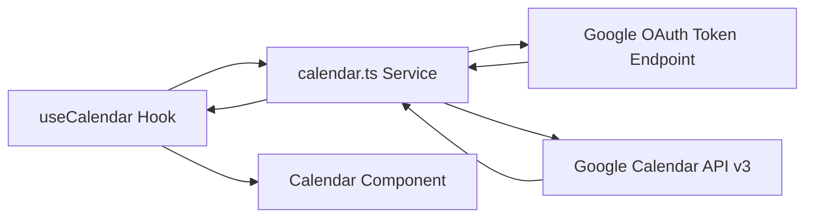
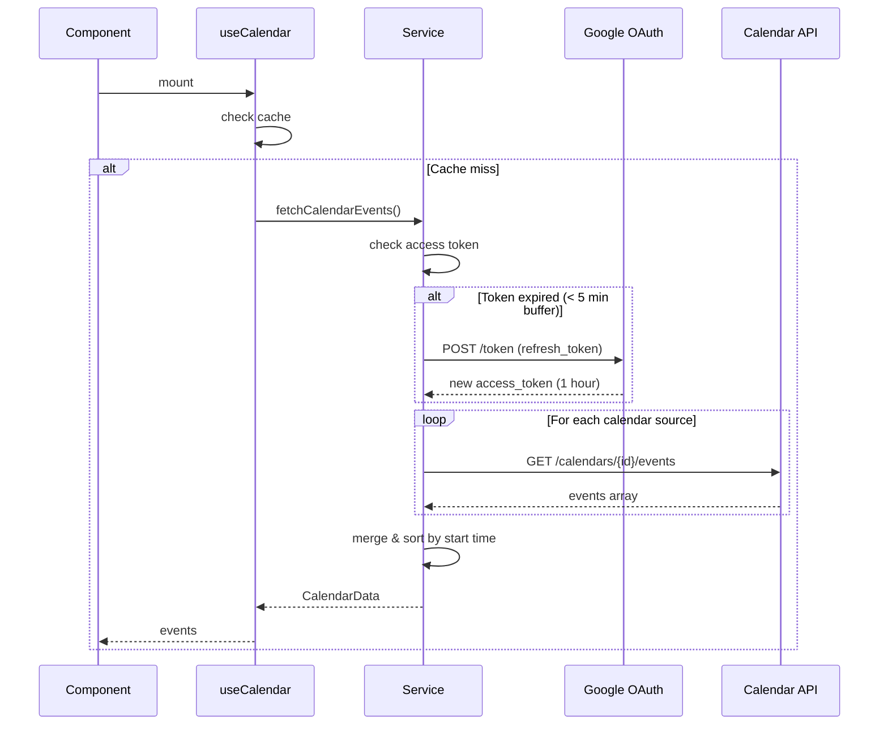
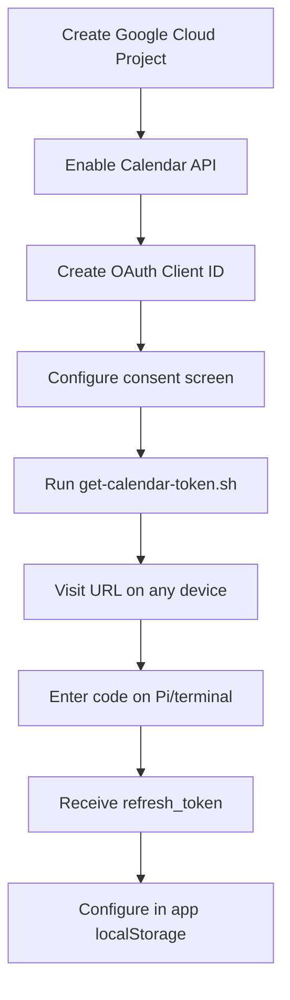

# Calendar Widget

## Overview

| Property | Value |
|----------|-------|
| Data Source | Google Calendar API v3 |
| Authentication | OAuth 2.0 with refresh token |
| Refresh Interval | 15 minutes |
| Cache Duration | 15 minutes |
| Location | Photo section overlay (72% of screen) |

## Purpose

Displays upcoming events from multiple Google Calendars (one per family member) with color-coded entries overlaid on the photo slideshow.

## Architecture



### Components

| Component | File | Responsibility |
|-----------|------|----------------|
| Calendar | `src/components/sections/Calendar/` | UI rendering, day grouping |
| useCalendar | `src/hooks/useCalendar.ts` | State, caching, auto-refresh |
| calendar service | `src/services/calendar.ts` | OAuth, API calls, parsing |

## Data Flow



## API Details

### OAuth Token Endpoint

| Property | Value |
|----------|-------|
| Endpoint | `https://oauth2.googleapis.com/token` |
| Method | POST |
| Content-Type | application/x-www-form-urlencoded |

**Request Body:**
```
client_id=xxx.apps.googleusercontent.com
client_secret=GOCSPX-xxx
refresh_token=1//xxx
grant_type=refresh_token
```

### Calendar API

| Property | Value |
|----------|-------|
| Endpoint | `https://www.googleapis.com/calendar/v3/calendars/{id}/events` |
| Method | GET |
| Auth | Bearer token |
| Scope | `https://www.googleapis.com/auth/calendar.readonly` |
| Documentation | https://developers.google.com/calendar/api/v3/reference |

**Query Parameters:**
```
timeMin=2024-02-16T00:00:00Z
timeMax=2024-02-23T23:59:59Z
singleEvents=true
orderBy=startTime
maxResults=100
```

## Data Model

### CalendarEvent

```typescript
interface CalendarEvent {
  id: string;              // Composite: "{calendarId}-{eventId}"
  title: string;           // Event summary
  start: Date;
  end: Date;
  isAllDay: boolean;       // true if date-only (no time)
  calendarId: string;      // Source calendar ID
  calendarName: string;    // Display name (e.g., "Espen")
  calendarColor: string;   // Hex color for styling
  calendarIcon?: string;   // Optional emoji
}
```

### CalendarSource

```typescript
interface CalendarSource {
  id: string;              // Google calendar ID
  name: string;            // Display name
  color: string;           // Hex color
  icon?: string;           // Optional emoji
}
```

### CalendarData

```typescript
interface CalendarData {
  events: CalendarEvent[];  // Sorted by start time
  fetchedAt: Date;
}
```

## Configuration

```typescript
config.calendar = {
  // OAuth credentials (from Google Cloud Console)
  clientId: "746014227403-xxx.apps.googleusercontent.com",
  clientSecret: "GOCSPX-xxx",
  refreshToken: "1//0xxx",

  // Calendar sources (one per family member)
  calendars: [
    {
      id: "primary",  // User's primary calendar
      name: "Espen",
      color: "#4285f4",  // Google Blue
      icon: "👨"
    },
    {
      id: "family@group.calendar.google.com",
      name: "Familie",
      color: "#0f9d58",  // Google Green
    },
    {
      id: "marie@gmail.com",
      name: "Marie",
      color: "#db4437",  // Google Red
      icon: "👩"
    },
  ],
};
```

## Setup Process



### Step-by-Step

1. **Create Google Cloud Project**
   - Go to https://console.cloud.google.com
   - Create new project

2. **Enable Calendar API**
   - APIs & Services → Library
   - Search "Google Calendar API" → Enable

3. **Create OAuth Client ID**
   - APIs & Services → Credentials
   - Create Credentials → OAuth client ID
   - Application type: **TV and Limited Input devices**
   - This type supports device code flow (no redirect URI needed)

4. **Run Token Script**
   ```bash
   ./scripts/get-calendar-token.sh
   ```
   - Displays URL to visit
   - Enter code on authorization page
   - Script outputs refresh_token

5. **Configure in App**
   - Open app in browser
   - Go to Settings
   - Enter OAuth credentials and calendar IDs

## Caching Strategy

```typescript
const CACHE_DURATION = 15 * 60 * 1000;   // 15 minutes
const REFRESH_INTERVAL = 15 * 60 * 1000; // 15 minutes

// Access token cached separately (1 hour validity)
let cachedAccessToken: string | null = null;
let tokenExpiresAt = 0;
```

**Rationale**: Calendar events don't change frequently. 15-minute cache balances freshness with API quota.

## Error Handling

- **Per-calendar errors**: If one calendar fails, others still load
- **Token refresh failure**: Shows "Kunne ikke fornye kalender-tilgang"
- **Stale data on error**: Keeps displaying cached events
- **Not configured**: Shows "Kalender ikke konfigurert"

## Multi-Calendar Support

Events from all calendars are:
1. Fetched in parallel (`Promise.all`)
2. Merged into single array
3. Sorted by start time
4. Styled with source calendar's color

```typescript
const eventArrays = await Promise.all(
  calendars.map((cal) => fetchSingleCalendarEvents(accessToken, cal, timeMin, timeMax))
);

const events = eventArrays
  .flat()
  .sort((a, b) => a.start.getTime() - b.start.getTime());
```

## All-Day Events

All-day events use date-only format (`YYYY-MM-DD`) instead of datetime:

```typescript
// Parse all-day date as local date (not UTC)
function parseAllDayDate(dateStr: string): Date {
  const [year, month, day] = dateStr.split('-').map(Number);
  return new Date(year, month - 1, day);
}
```

## Finding Calendar IDs

- **Primary calendar**: Use `"primary"` as ID
- **Shared calendars**: Find in Google Calendar settings → Calendar ID
- **Other users**: Use their email address as calendar ID (if shared with you)
