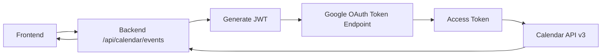
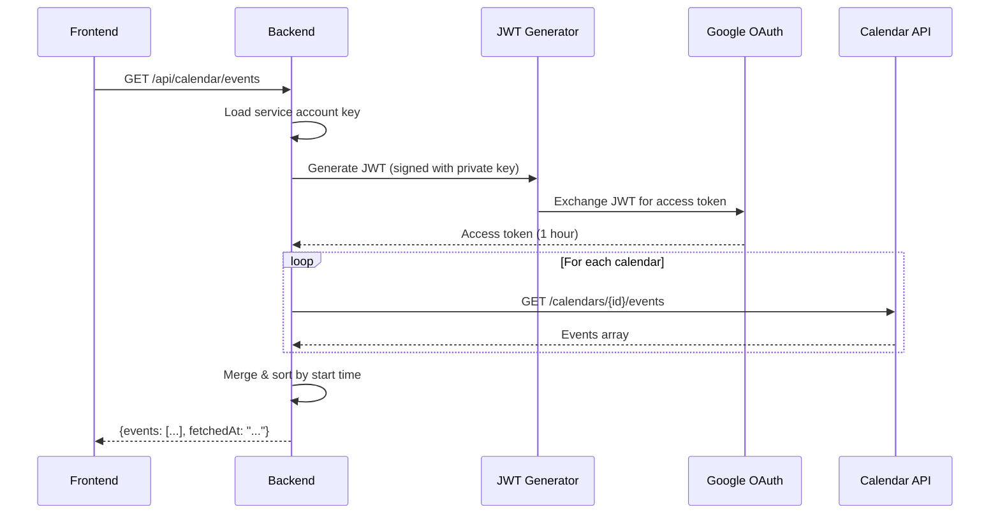

# Calendar Widget

## Overview

| Property | Value |
|----------|-------|
| Data Source | Google Calendar API v3 |
| Authentication | Service Account (JWT) |
| Refresh Interval | 15 minutes |
| Cache Duration | 15 minutes |
| Token Validity | 1 hour (auto-renewed) |
| Location | Photo section overlay (72% of screen) |

## Purpose

Displays upcoming events from multiple Google Calendars (one per family member) with color-coded entries overlaid on the photo slideshow.

## Architecture


```mermaid
flowchart LR
    A[Frontend] --> B[Backend /api/calendar/events]
    B --> C[Generate JWT]
    C --> D[Google OAuth Token Endpoint]
    D --> E[Access Token]
    E --> F[Calendar API v3]
    F --> B
    B --> A
```

### Components

| Component | File | Responsibility |
|-----------|------|----------------|
| Calendar | `src/components/sections/Calendar/` | UI rendering, day grouping |
| useCalendar | `src/hooks/useCalendar.ts` | State, caching, auto-refresh |
| calendar service | `src/services/calendar.ts` | Frontend API calls |
| calendar handler | `server/src/handlers/calendar.ts` | Backend JWT generation, Google API |

## Data Flow


```mermaid
sequenceDiagram
    participant Frontend
    participant Backend
    participant JWT as JWT Generator
    participant OAuth as Google OAuth
    participant API as Calendar API

    Frontend->>Backend: GET /api/calendar/events
    Backend->>Backend: Load service account key
    Backend->>JWT: Generate JWT (signed with private key)
    JWT->>OAuth: Exchange JWT for access token
    OAuth-->>Backend: Access token (1 hour)
    loop For each calendar
        Backend->>API: GET /calendars/{id}/events
        API-->>Backend: Events array
    end
    Backend->>Backend: Merge & sort by start time
    Backend-->>Frontend: {events: [...], fetchedAt: "..."}
```

## API Details

### Service Account Authentication

| Property | Value |
|----------|-------|
| Method | JWT (JSON Web Token) |
| Algorithm | RS256 (RSA with SHA-256) |
| Token Validity | 1 hour |
| Cache Strategy | In-memory with 5-min renewal buffer |

**JWT Generation:**
- Service account key loaded from `config.internal.json` (base64-encoded)
- JWT signed with private key from service account JSON
- Exchanged at `https://oauth2.googleapis.com/token` for access token
- Access token used as Bearer token for Calendar API requests

### Calendar API

| Property | Value |
|----------|-------|
| Endpoint | `https://www.googleapis.com/calendar/v3/calendars/{id}/events` |
| Method | GET |
| Auth | Bearer token |
| Scope | `https://www.googleapis.com/auth/calendar.readonly` |
| Documentation | https://developers.google.com/calendar/api/v3/reference |

**Query Parameters:**
```
timeMin=2024-02-16T00:00:00Z
timeMax=2024-02-23T23:59:59Z
singleEvents=true
orderBy=startTime
maxResults=100
```

## Data Model

### CalendarEvent

```typescript
interface CalendarEvent {
  id: string;              // Composite: "{calendarId}-{eventId}"
  title: string;           // Event summary
  start: Date;
  end: Date;
  isAllDay: boolean;       // true if date-only (no time)
  calendarId: string;      // Source calendar ID
  calendarName: string;    // Display name (e.g., "Espen")
  calendarColor: string;   // Hex color for styling
  calendarIcon?: string;   // Optional emoji
}
```

### CalendarSource

```typescript
interface CalendarSource {
  id: string;              // Google calendar ID
  name: string;            // Display name
  color: string;           // Hex color
  icon?: string;           // Optional emoji
}
```

### CalendarData

```typescript
interface CalendarData {
  events: CalendarEvent[];  // Sorted by start time
  fetchedAt: Date;
}
```

## Configuration

**Backend Config** (`server/data/config.internal.json`):
```json
{
  "calendar": {
    "serviceAccountKey": "ewogICJ0eX...base64-encoded JSON key...",
    "calendars": [
      {
        "id": "espenrydningen@gmail.com",
        "name": "Espen",
        "color": "#f44355"
      },
      {
        "id": "lenebu@gmail.com",
        "name": "Lene",
        "color": "#43f478"
      }
    ]
  }
}
```

**Service Account Details:**
- Email: `pi-537@familycalendar-489421.iam.gserviceaccount.com`
- Project: `familycalendar-489421`
- Scope: `https://www.googleapis.com/auth/calendar.readonly`

**Public Config** (`server/data/config.public.json`):
```json
{
  "calendar": {
    "calendars": [
      {"id": "espenrydningen@gmail.com", "name": "Espen", "color": "#f44355"}
    ],
    "configured": true
  }
}
```
Frontend receives only calendar metadata, never credentials.

## Setup Process

See complete guide: [`docs/architecture/calendar-service-account-setup.md`](./calendar-service-account-setup.md)

**Quick Summary:**

1. **Create Google Cloud Project & Service Account**
   - Go to https://console.cloud.google.com
   - Create project → Enable Calendar API
   - IAM & Admin → Service Accounts → Create
   - Download JSON key file

2. **Share Calendars with Service Account**
   - Open Google Calendar for each family member
   - Settings → Share with specific people
   - Add service account email (e.g., `pi-537@familycalendar-489421.iam.gserviceaccount.com`)
   - Permission: "See all event details"

3. **Configure Kiosk App**
   - Base64 encode service account JSON key
   - Add to `server/data/config.internal.json`
   - Restart backend server

**Critical Step:** Calendars MUST be shared with service account email or API returns 401 Unauthorized.

## Caching Strategy

**Backend JWT Cache:**
```typescript
let cachedJWT: { token: string; expiresAt: number } | null = null;
```
- JWT cached in memory for 1 hour
- Auto-renewed when < 5 minutes remaining
- No disk I/O for token refresh

**Frontend Cache:**
- 15-minute cache duration for calendar events
- Auto-refresh every 15 minutes
- Cache stored in React hook state

**Rationale**: Calendar events don't change frequently. 15-minute cache balances freshness with API quota. JWT caching avoids regenerating signatures unnecessarily.

## Error Handling

- **Per-calendar errors**: If one calendar fails (e.g., not shared), others still load
- **Authentication failure**: Returns 401 if service account lacks access to calendar
- **Not configured**: Backend returns `{events: [], error: "Calendar not configured"}`
- **Backend logs**: Errors logged to journalctl for debugging (`journalctl | grep "Calendar API error"`)

**Common Errors:**
- `401 Unauthorized`: Calendar not shared with service account email
- `403 Forbidden`: Service account lacks Calendar API permission in Google Cloud
- `404 Not Found`: Calendar ID doesn't exist or was deleted

## Multi-Calendar Support

Events from all calendars are:
1. Fetched in parallel (`Promise.all`)
2. Merged into single array
3. Sorted by start time
4. Styled with source calendar's color

```typescript
const eventArrays = await Promise.all(
  calendars.map((cal) => fetchSingleCalendarEvents(accessToken, cal, timeMin, timeMax))
);

const events = eventArrays
  .flat()
  .sort((a, b) => a.start.getTime() - b.start.getTime());
```

## All-Day Events

All-day events use date-only format (`YYYY-MM-DD`) instead of datetime:

```typescript
// Parse all-day date as local date (not UTC)
function parseAllDayDate(dateStr: string): Date {
  const [year, month, day] = dateStr.split('-').map(Number);
  return new Date(year, month - 1, day);
}
```

## Finding Calendar IDs

**For personal Google calendars:**
- Use the user's Gmail address as calendar ID (e.g., `espenrydningen@gmail.com`)
- The user must share their calendar with the service account email

**For shared/group calendars:**
- Find in Google Calendar settings → "Integrate calendar" → Calendar ID
- Usually format: `groupname@group.calendar.google.com`

**Service Account Access:**
- Service accounts CANNOT use `"primary"` as calendar ID
- Each calendar must be explicitly shared with service account email
- Permission required: "See all event details" (not just free/busy)
