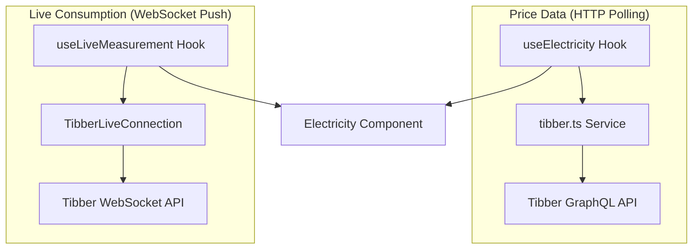
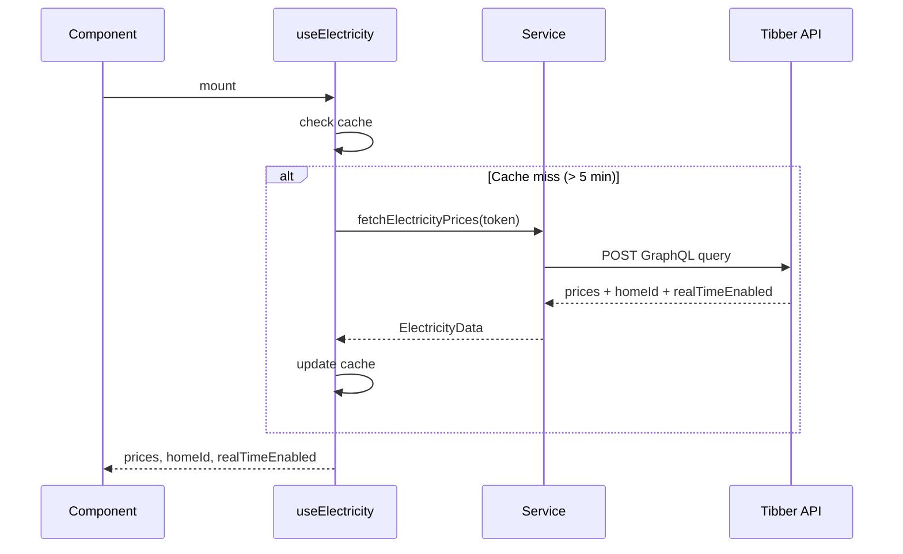
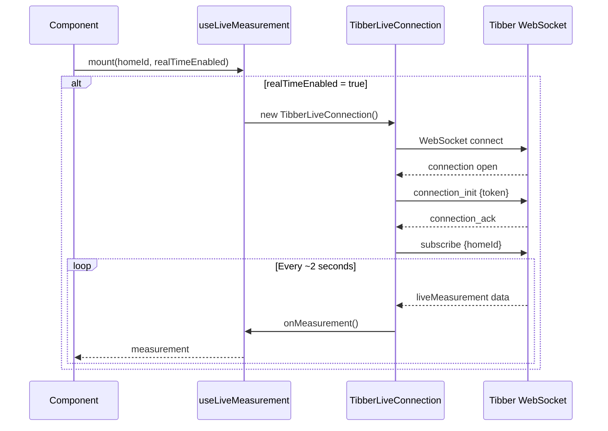

# Electricity Widget

## Overview

| Property | Value |
|----------|-------|
| Data Source | Tibber GraphQL API |
| Authentication | Bearer token |
| Refresh Interval | 5 minutes (prices), ~2 seconds (live) |
| Cache Duration | 5 minutes |
| Location | Electricity section (8% of screen) |

## Purpose

Displays current electricity price, 24-hour price chart with color-coded bars, and real-time power consumption from Tibber Pulse smart meter.

## Architecture



### Components

| Component | File | Responsibility |
|-----------|------|----------------|
| Electricity | `src/components/sections/Electricity/` | UI, price chart, live display |
| useElectricity | `src/hooks/useElectricity.ts` | Price state, caching |
| useLiveMeasurement | `src/hooks/useLiveMeasurement.ts` | WebSocket subscription |
| tibber service | `src/services/tibber.ts` | API calls, WebSocket class |

## Data Flow - Prices



## Data Flow - Live Consumption



## API Details

### GraphQL Endpoint (Prices)

| Property | Value |
|----------|-------|
| Endpoint | `https://api.tibber.com/v1-beta/gql` |
| Method | POST |
| Auth | `Authorization: Bearer {token}` |
| Documentation | https://developer.tibber.com/ |

**GraphQL Query:**
```graphql
{
  viewer {
    homes {
      id
      features {
        realTimeConsumptionEnabled
      }
      currentSubscription {
        priceInfo {
          current {
            total
            energy
            tax
            startsAt
            level
          }
          today {
            total energy tax startsAt level
          }
          tomorrow {
            total energy tax startsAt level
          }
        }
      }
    }
  }
}
```

### WebSocket Endpoint (Live)

| Property | Value |
|----------|-------|
| Endpoint | `wss://websocket-api.tibber.com/v1-beta/gql/subscriptions` |
| Protocol | `graphql-transport-ws` |
| Auth | Token in `connection_init` payload |

**Subscription:**
```graphql
subscription LiveMeasurement($homeId: ID!) {
  liveMeasurement(homeId: $homeId) {
    timestamp
    power
    accumulatedConsumption
    accumulatedCost
    currency
  }
}
```

## Data Model

### ElectricityData

```typescript
interface ElectricityData {
  homeId: string | null;        // Required for WebSocket subscription
  realTimeEnabled: boolean;     // true if Tibber Pulse installed
  current: PriceInfo | null;    // Current hour price
  today: PriceInfo[];           // 24 hourly prices
  tomorrow: PriceInfo[];        // Next day (available after 13:00)
}
```

### PriceInfo

```typescript
interface PriceInfo {
  total: number;     // NOK/kWh (spot + tax, excludes grid fee!)
  energy: number;    // Spot price component
  tax: number;       // Tax component
  startsAt: Date;    // Hour start time
  level: PriceLevel;
}

type PriceLevel =
  | 'VERY_CHEAP'
  | 'CHEAP'
  | 'NORMAL'
  | 'EXPENSIVE'
  | 'VERY_EXPENSIVE';
```

### LiveMeasurement

```typescript
interface LiveMeasurement {
  timestamp: Date;
  power: number;                    // Current consumption in Watts
  accumulatedConsumption: number;   // kWh since midnight
  accumulatedCost: number | null;   // NOK since midnight
  currency: string;                 // Usually "NOK"
}
```

## Price Level Colors

| Level | Color | Hex | Typical Range |
|-------|-------|-----|---------------|
| VERY_CHEAP | Green | #22c55e | < 0.5 kr/kWh |
| CHEAP | Lime | #84cc16 | 0.5-1.0 kr/kWh |
| NORMAL | Yellow | #eab308 | 1.0-2.0 kr/kWh |
| EXPENSIVE | Orange | #f97316 | 2.0-3.0 kr/kWh |
| VERY_EXPENSIVE | Red | #ef4444 | > 3.0 kr/kWh |

## Configuration

```typescript
config.apiKeys = {
  tibber: "your-tibber-api-token",
};

config.electricity = {
  gridFee: 0.36,  // NOK/kWh - must be added manually
};
```

### Getting Tibber API Token

1. Go to https://developer.tibber.com/
2. Sign in with Tibber account
3. Generate personal access token
4. Copy token to app settings

## Grid Fee (Nettleie)

**Important**: Tibber API `total` only includes:
- Spot price (energy)
- Electricity tax

It does **not** include grid fee (nettleie), which varies by network company.

```
Actual price = total + gridFee
```

Default grid fee is set to 0.36 kr/kWh (Tensio/Trondheim). Update for your location.

### Finding Your Grid Fee

1. Check your electricity bill
2. Or visit your grid company's website
3. Look for "nettleie" or "fastledd + energiledd"

## WebSocket Connection Management

```typescript
class TibberLiveConnection {
  // Automatic reconnection with exponential backoff
  private reconnectAttempts = 0;
  private maxReconnectAttempts = 5;

  private scheduleReconnect() {
    const delay = Math.min(1000 * Math.pow(2, this.reconnectAttempts), 30000);
    // 1s, 2s, 4s, 8s, 16s, 30s max
    setTimeout(() => this.connect(), delay);
  }
}
```

### Connection Lifecycle

1. `connect()` - Opens WebSocket
2. `connection_init` - Sends auth token
3. `connection_ack` - Server confirms
4. `subscribe` - Starts measurement stream
5. `next` - Receives data every ~2 seconds
6. `disconnect()` - Cleanup on unmount

## Caching Strategy

```typescript
// Prices only - live data not cached
const CACHE_DURATION = 5 * 60 * 1000;   // 5 minutes
const REFRESH_INTERVAL = 5 * 60 * 1000; // 5 minutes
```

**Rationale**: Prices update hourly but we check every 5 minutes to catch the hour boundary. Live consumption is real-time, no caching.

## Error Handling

- **No token**: Shows "Tibber API-nøkkel ikke konfigurert"
- **API error**: Keeps showing cached prices
- **WebSocket error**: Shows connection status, auto-reconnects
- **No Pulse**: `realTimeEnabled: false` - live section hidden

## Display Features

### Price Chart

- 24 horizontal bars (one per hour)
- Color-coded by price level
- Current hour highlighted
- Tomorrow prices shown after 13:00

### Live Consumption

- Current power in kW (e.g., "2.4 kW")
- Daily accumulated in kWh
- Updates every ~2 seconds
- Only shown if Tibber Pulse installed

## Tibber Pulse Requirements

For live consumption:
1. Tibber subscription active
2. Tibber Pulse device installed on smart meter
3. `realTimeConsumptionEnabled: true` in API response
