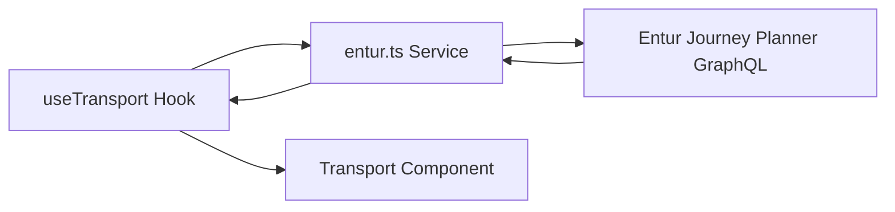
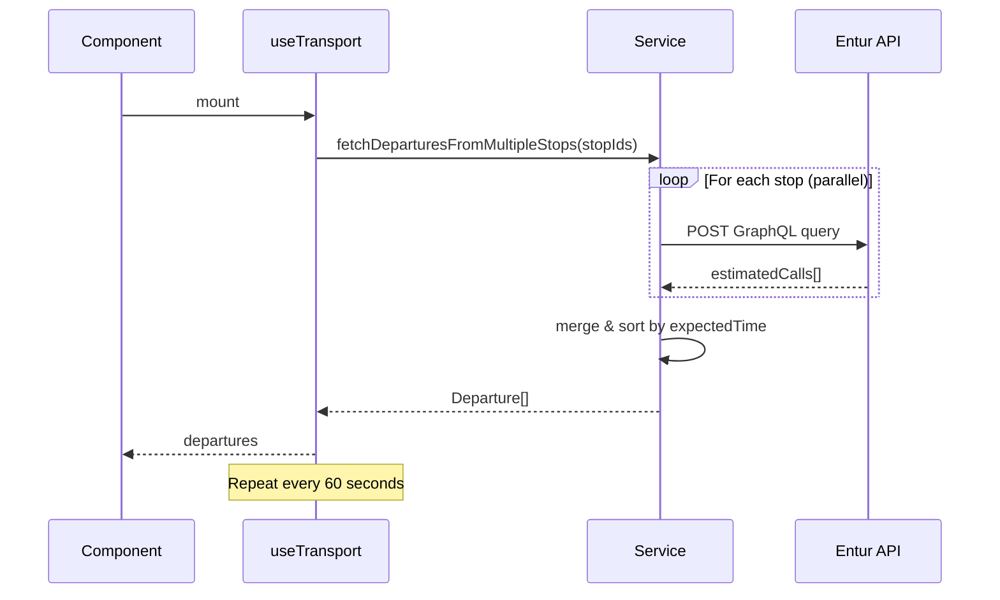

# Transport Widget

## Overview

| Property | Value |
|----------|-------|
| Data Source | Entur Journey Planner GraphQL API |
| Authentication | Client name header (no API key) |
| Refresh Interval | 1 minute |
| Cache Duration | None (always fresh) |
| Location | Transport section (10% of screen) |

## Purpose

Displays upcoming bus, tram, and metro departures from nearby stops with real-time arrival predictions.

## Architecture



### Components

| Component | File | Responsibility |
|-----------|------|----------------|
| Transport | `src/components/sections/Transport/` | UI rendering, time formatting |
| useTransport | `src/hooks/useTransport.ts` | State, auto-refresh |
| entur service | `src/services/entur.ts` | GraphQL queries, data parsing |

## Data Flow



## API Details

| Property | Value |
|----------|-------|
| Endpoint | `https://api.entur.io/journey-planner/v3/graphql` |
| Method | POST |
| Auth | `ET-Client-Name: espen-kioskapp` header |
| Rate Limit | Generous (public transit API) |
| Documentation | https://developer.entur.org/pages-journeyplanner-journeyplanner |

### GraphQL Query

```graphql
query GetDepartures($stopPlaceId: String!, $numberOfDepartures: Int!) {
  stopPlace(id: $stopPlaceId) {
    id
    name
    estimatedCalls(numberOfDepartures: $numberOfDepartures) {
      expectedDepartureTime    # Real-time adjusted
      aimedDepartureTime       # Scheduled time
      realtime                 # Has GPS tracking
      destinationDisplay {
        frontText              # Destination name
      }
      serviceJourney {
        line {
          publicCode           # Line number (e.g., "4", "79")
          name                 # Full line name
          transportMode        # bus, tram, metro, etc.
        }
      }
      quay {
        name                   # Platform/stop name
      }
    }
  }
}
```

### Example Request

```bash
curl -X POST https://api.entur.io/journey-planner/v3/graphql \
  -H "Content-Type: application/json" \
  -H "ET-Client-Name: espen-kioskapp" \
  -d '{
    "query": "query { stopPlace(id: \"NSR:StopPlace:42220\") { name estimatedCalls(numberOfDepartures: 5) { expectedDepartureTime destinationDisplay { frontText } serviceJourney { line { publicCode } } } } }"
  }'
```

## Data Model

### Departure

```typescript
interface Departure {
  line: string;           // Line number (e.g., "4", "79")
  lineName: string;       // Full line name
  destination: string;    // Final destination
  scheduledTime: Date;    // Timetable time
  expectedTime: Date;     // Real-time predicted time
  isRealtime: boolean;    // true if GPS-tracked
  quayName?: string;      // Platform identifier
}
```

## Configuration

```typescript
config.location = {
  stopPlaceIds: [
    "NSR:StopPlace:42220",  // Prinsenkrysset
    "NSR:StopPlace:41618",  // Munkegata M1
  ],
};
```

### Finding Stop Place IDs

1. **Entur Stop Place Registry**: https://stoppested.entur.org/
   - Search for stop name
   - Copy NSR ID (format: `NSR:StopPlace:XXXXX`)

2. **Entur Journey Planner**: https://entur.no/
   - Search for your stop
   - ID visible in URL

### Stop ID Format

```
NSR:StopPlace:XXXXX     # Stop place (area with multiple quays)
NSR:Quay:YYYYY          # Specific platform/quay
```

Use `StopPlace` IDs to get all departures from the area.

## Multi-Stop Support

```typescript
export async function fetchDeparturesFromMultipleStops(
  stopPlaceIds: string[],
  numberOfDepartures: number = 5
): Promise<Departure[]> {
  // Fetch all stops in parallel
  const allDepartures = await Promise.all(
    stopPlaceIds.map((id) => fetchDepartures(id, numberOfDepartures))
  );

  // Merge and sort by time
  const merged = allDepartures.flat();
  merged.sort((a, b) => a.expectedTime.getTime() - b.expectedTime.getTime());

  return merged;
}
```

## Time Formatting

### Time Until Departure

```typescript
function formatTimeUntil(departure: Date): string {
  const diffMinutes = Math.floor((departure - now) / 60000);

  if (diffMinutes <= 0) return 'Nå';
  if (diffMinutes < 60) return `${diffMinutes} min`;

  const hours = Math.floor(diffMinutes / 60);
  const minutes = diffMinutes % 60;
  return `${hours}t ${minutes}m`;
}
```

| Time Until | Display |
|------------|---------|
| Past/Now | "Nå" |
| 5 minutes | "5 min" |
| 45 minutes | "45 min" |
| 1 hour 15 min | "1t 15m" |

### Departure Time

```typescript
function formatDepartureTime(date: Date): string {
  return new Intl.DateTimeFormat('nb-NO', {
    hour: '2-digit',
    minute: '2-digit',
    hour12: false,
  }).format(date);  // e.g., "14:32"
}
```

## Refresh Strategy

```typescript
const REFRESH_INTERVAL = 60 * 1000; // 1 minute

// No caching - always fetch fresh
useEffect(() => {
  fetchData();  // Initial fetch

  const interval = setInterval(fetchData, REFRESH_INTERVAL);
  return () => clearInterval(interval);
}, []);
```

**Rationale**: Real-time departures change frequently. 1-minute refresh ensures accurate countdown without excessive API calls.

## Error Handling

- **No stops configured**: Shows "Ingen holdeplasser konfigurert"
- **API error**: Logs error, keeps showing last known departures
- **Empty response**: Shows empty state, no departures

## Real-Time vs Scheduled

```typescript
interface Departure {
  scheduledTime: Date;  // From timetable
  expectedTime: Date;   // GPS-adjusted (if available)
  isRealtime: boolean;  // true = GPS tracking active
}
```

- Display always uses `expectedTime`
- `isRealtime: true` indicates live GPS tracking
- `isRealtime: false` uses scheduled time as expected

## Transport Modes

Entur supports multiple transport modes:

| Mode | Icon | Example |
|------|------|---------|
| bus | 🚌 | City buses |
| tram | 🚋 | Trondheim tram |
| metro | 🚇 | Oslo T-bane |
| rail | 🚆 | NSB trains |
| water | ⛴️ | Ferries |

The `transportMode` field can be used for icons/styling.

## Norwegian Transit Context

Entur is Norway's national public transit platform, aggregating data from:
- AtB (Trondheim)
- Ruter (Oslo)
- Skyss (Bergen)
- Kolumbus (Stavanger)
- And all other Norwegian transit operators

All Norwegian public transport data is available through this single API.
