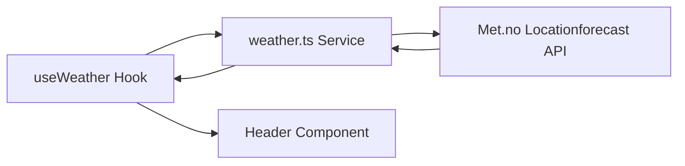
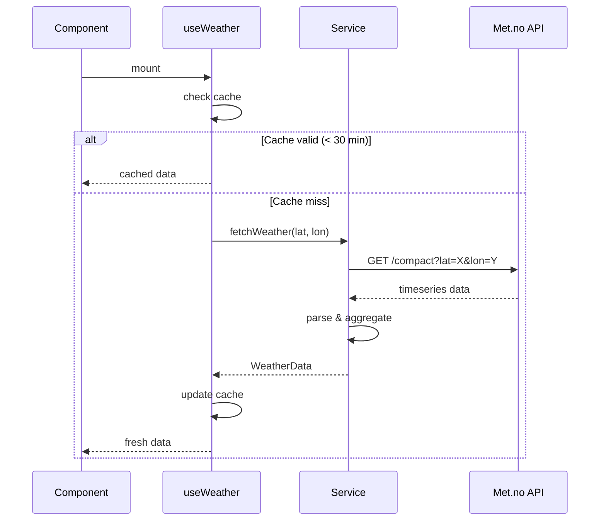

# Weather Widget

## Overview

| Property | Value |
|----------|-------|
| Data Source | Met.no Locationforecast API |
| Authentication | User-Agent header |
| Refresh Interval | 30 minutes |
| Cache Duration | 30 minutes |
| Location | Header section (10% of screen) |

## Purpose

Displays current temperature, weather icon, and 5-day forecast in the header section.

## Architecture



### Components

| Component | File | Responsibility |
|-----------|------|----------------|
| Header | `src/components/sections/Header/` | UI rendering |
| useWeather | `src/hooks/useWeather.ts` | State, caching, auto-refresh |
| weather service | `src/services/weather.ts` | API calls, data parsing |

## Data Flow



## API Details

| Property | Value |
|----------|-------|
| Endpoint | `https://api.met.no/weatherapi/locationforecast/2.0/compact` |
| Method | GET |
| Auth | User-Agent header: `KioskApp/1.0 github.com/espenr/kiosk-app` |
| Rate Limit | Generous (Norwegian government API) |
| Response Format | GeoJSON with hourly timeseries |
| Documentation | https://api.met.no/weatherapi/locationforecast/2.0/documentation |

### Request Example

```
GET https://api.met.no/weatherapi/locationforecast/2.0/compact?lat=63.4305&lon=10.3951
User-Agent: KioskApp/1.0 github.com/espenr/kiosk-app
```

## Data Model

### WeatherData

```typescript
interface WeatherData {
  current: CurrentWeather;
  forecast: DayForecast[];
}

interface CurrentWeather {
  temperature: number;    // Celsius, rounded to integer
  symbol: string;         // Met.no symbol code (e.g., "clearsky_day")
  updatedAt: Date;
}

interface DayForecast {
  date: Date;
  dayName: string;        // Norwegian short name (Man, Tir, Ons, etc.)
  high: number;           // Max temperature for day
  low: number;            // Min temperature for day
  symbol: string;         // Weather symbol for midday
}
```

### Weather Symbols

Met.no uses symbol codes like `clearsky_day`, `partlycloudy_night`, `rain`, etc.

| Symbol Base | Emoji | Description |
|-------------|-------|-------------|
| clearsky | ☀️ | Clear sky |
| fair | 🌤️ | Fair weather |
| partlycloudy | ⛅ | Partly cloudy |
| cloudy | ☁️ | Cloudy |
| fog | 🌫️ | Fog |
| rain | 🌧️ | Rain |
| snow | ❄️ | Snow |
| thunder | ⛈️ | Thunder |

## Configuration

```typescript
// In ConfigContext
config.location = {
  latitude: 63.4305,   // Trondheim default
  longitude: 10.3951,
};
```

### Finding Coordinates

Use Google Maps or similar:
1. Right-click on location
2. Copy coordinates (lat, lon)

## Caching Strategy

```typescript
// Module-level cache
let cachedWeather: WeatherData | null = null;
let cacheTimestamp = 0;

const CACHE_DURATION = 30 * 60 * 1000;  // 30 minutes
const REFRESH_INTERVAL = 30 * 60 * 1000; // 30 minutes
```

**Rationale**: Met.no data updates hourly, so 30-minute cache provides good balance between freshness and API efficiency.

## Error Handling

- Shows cached data if API fails
- Displays "Lokasjon ikke konfigurert" if coordinates missing
- Logs technical errors to console

## Data Aggregation

The service aggregates hourly timeseries into daily forecasts:

1. Groups timeseries entries by date
2. Calculates min/max temperatures per day
3. Selects midday symbol (10:00-14:00) for day representation
4. Returns 5 days starting from today
