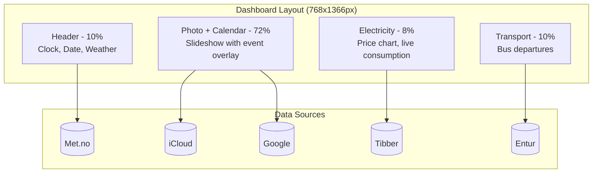

# Widgets Overview

The kiosk dashboard displays five data-driven widgets, each following a consistent service/hook architecture pattern.

## Dashboard Layout



## Widget Documentation

| Widget | Document | Data Source | Auth |
|--------|----------|-------------|------|
| Weather | [widget-weather.md](./widget-weather.md) | Met.no API | User-Agent |
| Photo Slideshow | [photo-slideshow.md](./photo-slideshow.md) | iCloud SharedStreams | Token in URL |
| Calendar | [widget-calendar.md](./widget-calendar.md) | Google Calendar API | OAuth 2.0 |
| Electricity | [widget-electricity.md](./widget-electricity.md) | Tibber GraphQL | Bearer token |
| Transport | [widget-transport.md](./widget-transport.md) | Entur GraphQL | Client header |

## Refresh Intervals

| Widget | Refresh | Cache | Rationale |
|--------|---------|-------|-----------|
| Weather | 30 min | 30 min | Data updates hourly |
| Photos | 10 min | 45 min (server) | URLs expire in ~2 hours |
| Calendar | 15 min | 15 min | Events change infrequently |
| Electricity | 5 min | 5 min | Prices update hourly |
| Transport | 1 min | None | Real-time departures |

## Common Architecture Pattern

All widgets follow the same three-layer architecture:

```
┌─────────────────────┐
│   React Component   │  Presentation layer
│    (UI rendering)   │
└──────────┬──────────┘
           │
┌──────────▼──────────┐
│   Custom Hook       │  State management layer
│ (state, caching,    │  - Module-level cache
│  auto-refresh)      │  - Auto-refresh interval
└──────────┬──────────┘  - Error handling
           │
┌──────────▼──────────┐
│   Service Module    │  Data access layer
│ (API calls, types,  │  - HTTP/GraphQL calls
│  parsing)           │  - Response parsing
└──────────┬──────────┘  - Type definitions
           │
┌──────────▼──────────┐
│   External API      │
└─────────────────────┘
```

### File Naming Convention

```
src/
├── components/sections/{Widget}/
│   ├── index.tsx           # Main component
│   └── {SubComponent}.tsx  # Sub-components
├── hooks/
│   └── use{Widget}.ts      # Custom hook
└── services/
    └── {api}.ts            # Service module
```

## Caching Strategy

All hooks use module-level caching:

```typescript
// Module scope - persists across component remounts
let cachedData: T | null = null;
let cacheTimestamp = 0;

export function useWidget() {
  const fetchData = useCallback(async (force = false) => {
    // Return cached data if fresh
    if (!force && cachedData && Date.now() - cacheTimestamp < CACHE_DURATION) {
      setData(cachedData);
      return;
    }

    // Fetch and cache
    const data = await service.fetch();
    cachedData = data;
    cacheTimestamp = Date.now();
    setData(data);
  }, []);
}
```

## Auto-Refresh Pattern

```typescript
// Initial fetch on mount
useEffect(() => {
  fetchData();
}, [fetchData]);

// Periodic refresh
useEffect(() => {
  const interval = setInterval(() => {
    fetchData(true);  // force=true bypasses cache
  }, REFRESH_INTERVAL);

  return () => clearInterval(interval);
}, [fetchData]);
```

## Error Handling

All widgets follow these principles:

1. **Show stale data on error** - Keep displaying cached data if API fails
2. **Norwegian error messages** - User-facing errors in Norwegian
3. **Console logging** - Technical errors logged for debugging
4. **Graceful degradation** - Show "ikke konfigurert" instead of crashing

```typescript
try {
  const data = await fetchData();
  setData(data);
  setError(null);
} catch (err) {
  console.error('Fetch error:', err);
  setError('Kunne ikke hente data');
  // Keep showing cached data
  if (cachedData) {
    setData(cachedData);
  }
}
```

## Configuration

All widgets read from `ConfigContext`:

```typescript
const { config } = useConfig();

// Location-based widgets
const { latitude, longitude, stopPlaceIds } = config.location;

// API keys
const { tibber } = config.apiKeys;

// Widget-specific settings
const { interval } = config.photos;
const { gridFee } = config.electricity;
const { clientId, calendars } = config.calendar;
```

Configuration persists to localStorage via the context provider.
